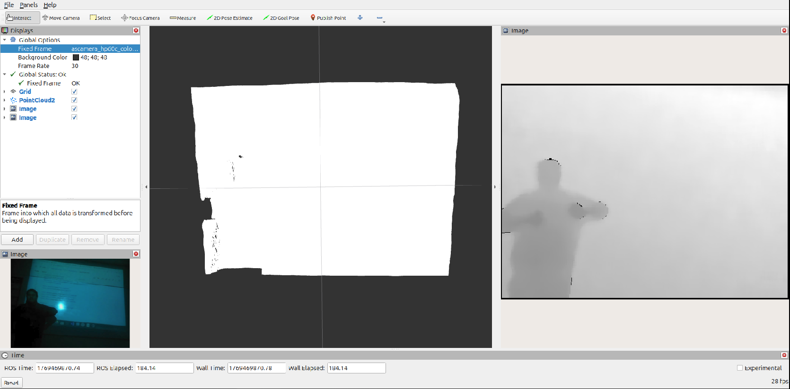

# ascam_ros2: Driver de Cámara RGBD

**Este paquete permite la integración de la cámara de profundidad en ROS 2.**



## 1. Clonar
Sitúate en tu espacio de trabajo y clona el repositorio:

```bash
cd ~/ascamera_ros2_ws/src
git clone https://github.com/j0z3ph/ascam_ros2.git

```

## 2. Compilar

Compila el paquete:

```bash
cd ~/ascamera_ros2_ws/
colcon build --symlink-install --packages-select ascamera

```

## 3. Instalar reglas udev

Configura los permisos USB para no requerir sudo al usar la cámara:

```bash
cd ~/ascamera_ros2_ws/src/ascam_ros2/ascamera/scripts
sudo bash create_udev_rules.sh

```

*(Desconecta y vuelve a conectar la cámara después de este paso).*

## 4. Actualizar ruta de configuración (Importante)

El driver requiere que especifiques manualmente la ruta del archivo de configuración `.json`.

1. **Obtén la ruta de tu archivo de configuración:**
*(Copia la ruta que te muestre este comando)*
```bash
ls ~/ascamera_ros2_ws/src/ascam_ros2/ascamera/configurationfiles/hp60c_v2_00_20230704_configEncrypt.json

```


2. **Edita el archivo de lanzamiento:**
Entra a la carpeta launch y abre el archivo:
```bash
cd ~/ascamera_ros2_ws/src/ascam_ros2/ascamera/launch
nano hp60c.launch.py

```


3. **Pega la ruta:**
Busca la variable `config_path` y reemplaza su contenido con la ruta completa que copiaste en el paso 1.

## 5. Ejecución (Launch)

Carga el entorno y lanza el driver:

```bash
source ~/ascamera_ros2_ws/install/setup.bash
ros2 launch ascamera hp60c.launch.py

```

## 6. Visualización

Para ver las imágenes y la nube de puntos:

```bash
# Opción 1: RQT Image View
ros2 run rqt_image_view rqt_image_view

# Opción 2: RViz2 (Recomendado)
rviz2

```

### Configuración RViz

* **Frame ID:** `ascamera_hp60c_color_0`
* **Tópicos:** Agrega `/ascamera/images` o `/ascamera/depth`.

```

```