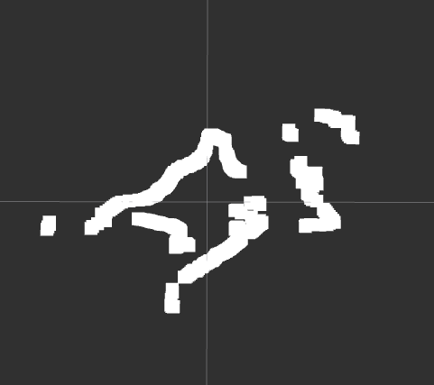

# Driver ROS 2 para MS200 / Oradar

**Driver Nativo de ROS 2 Jazzy para LiDAR MS200**



## Descripción General
Este paquete proporciona un driver nativo de ROS 2 para el sensor LiDAR TOF MS200 (también conocido como Oradar MS200 o MKS MS200). Está desarrollado íntegramente en Python, implementando el protocolo de comunicación serial de bajo nivel para decodificar los paquetes de datos y publicar mensajes estándar `sensor_msgs/LaserScan`.

Este driver está diseñado para ser ligero y no depende de SDKs propietarios o cerrados.

## Características
* **Implementación Nativa:** Escrito en Python utilizando la librería `pyserial`.
* **Soporte de Protocolo:** Detecta automáticamente el encabezado de trama estándar 54 2C.
* **Compatibilidad:** Probado en Raspberry Pi 5 con ROS 2 Jazzy.
* **Salida Estándar:** Publica en el tópico `/scan`, compatible con Nav2 y SLAM Toolbox.

## Requisitos de Hardware
* **Sensor:** MKS MS200 / Oradar MS200 TOF LiDAR.
* **Interfaz:** Adaptador USB a Serial (ej. CP2102, CH340).
* **Plataforma:** Sistema basado en Linux (Raspberry Pi, x86_64) con ROS 2 instalado.

## Instalación

1. Clonar el repositorio en el espacio de trabajo:
   ```bash
   cd ~/ros2_ws/src
   git clone https://github.com/jasonmm24/ms200_driver.git
   ```

2. Instalar dependencias:
   ```bash
   cd ~/ros2_ws
   rosdep install --from-paths src --ignore-src -r -y
   ```

3. Compilar el paquete:
   ```bash
   colcon build --symlink-install --packages-select ms200_driver
   source install/setup.bash
   ```

## Configuración

Asegúrese de que el usuario tenga permisos para acceder al puerto serial. Puede establecer permisos temporales con:

```bash
sudo chmod 777 /dev/ttyUSB0
```

Para acceso permanente, agregue su usuario al grupo `dialout`:

```bash
sudo usermod -a -G dialout $USER
```
(Se requiere reiniciar el sistema o cerrar sesión para que este cambio surta efecto).

## Uso

### Ejecución del Nodo

Para iniciar el driver con la configuración predeterminada:
```bash
ros2 run ms200_driver ms200_node
```

### Ejecución con Parámetros Personalizados

Puede modificar el puerto serial, la velocidad o el ID del frame en tiempo de ejecución:
```bash
ros2 run ms200_driver ms200_node --ros-args -p port:=/dev/ttyUSB1 -p baudrate:=115200
```

### Visualización en RViz2

1. Iniciar RViz2: `rviz2`
2. Establecer **Fixed Frame** en: `laser_frame`
3. Agregar el tópico: `/scan`

## Parámetros

| Parámetro | Tipo | Predeterminado | Descripción |
| :--- | :--- | :--- | :--- |
| `port` | string | `/dev/ttyUSB0` | El puerto serial donde está conectado el LiDAR. |
| `baudrate` | int | `230400` | Velocidad de comunicación (Baud rate). |
| `frame_id` | string | `laser_frame` | El ID del marco TF asociado al mensaje LaserScan. |

## Tópicos Publicados

* `/scan` (`sensor_msgs/msg/LaserScan`): Datos del escaneo láser 2D.

## Autor

**Jonathan Jason Medina Martinez**
* Organización: **OPEN SOURCE - UPIITA - C-ROS**
* Email: jason240208@gmail.com

## Licencia

Este proyecto está bajo la Licencia **MIT**.
